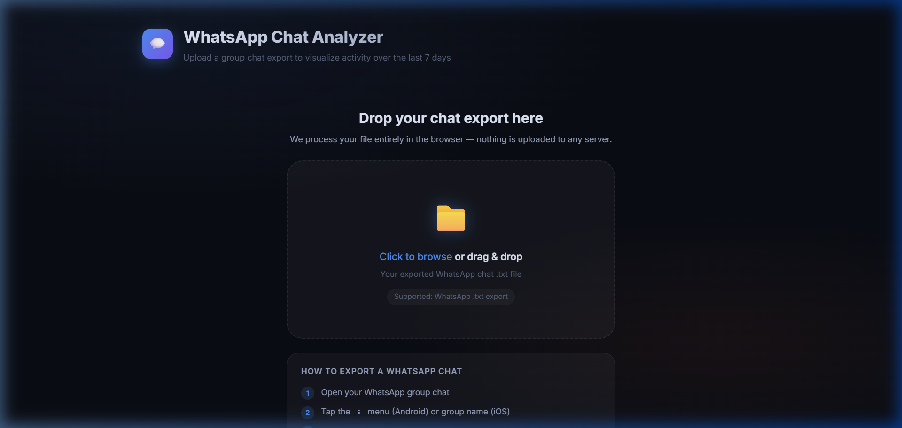
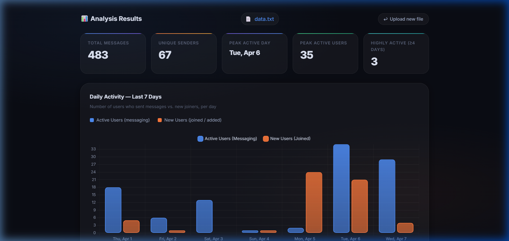
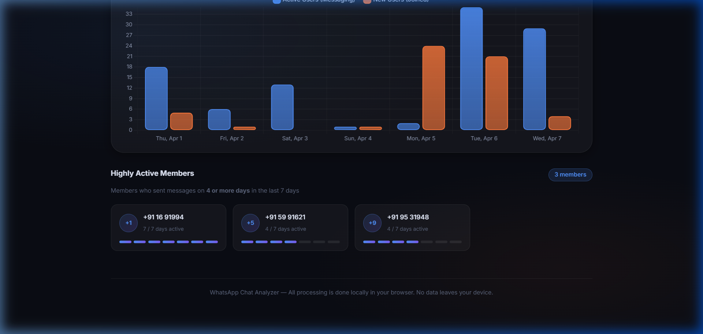

# WhatsApp Chat Analyzer

A fully client-side web application that parses WhatsApp group chat exports, extracts user activity metrics, and visualizes them over the last 7 days. Designed with a premium dark-mode, glassmorphism aesthetic.

**🚀 Live Demo:** [https://100days-two.vercel.app/](https://100days-two.vercel.app/)

## Features

- **Privacy-First Data Processing**: Parses and analyzes your chat export entirely in your browser using the File API. No server necessary, no data upload required.
- **Interactive Visualization**: Uses `Chart.js` to render a grouped bar chart plotting daily active users (those who send messages) against new users joining the group.
- **Detailed Metrics & Highlights**:
  - Total message counts
  - Unique users interacting
  - Peak active days tracking
- **Highly Active Members List**: Automatically generates a list of top contributors (active on $\ge$ 4 days within the last week).
- **Responsive & Premium UI**: Fluid animations, native drag-and-drop interactions, counting effects, and error handling seamlessly integrated into a modern glassmorphism design.

---

## Screenshots

### 1. File Upload Screen 
*Drag and drop your exported `data.txt` file here.*


### 2. Analysis Results & Chart
*Visualizing Daily Active Users vs. New Users over the last 7 days.*


### 3. Highly Active Members
*List of users active for $\ge$ 4 out of the 7 analyzed days.*


---

## Tech Stack

The application is built completely dependency-free for structure and styling, maintaining extreme portabliity.

- **HTML5**: Semantic document structure
- **CSS3 / Vanilla CSS**: Custom 500+ line stylesheet implementing gradients, flex/grid layouts, animations, and ARIA accessibility cues. **No Bootstrap or external CSS frameworks.**
- **Vanilla ES6+ JavaScript**: Clean, IIFE module-based architecture split into data parsing, analytic reduction, and DOM synchronization.
- **Chart.js** (v4.4+): Dynamically loaded via CDN for high-performance canvas visualizations.

---

## Project Architecture

```
100days/
├── index.html           # Main UI Shell and Entry Point
├── css/
│   └── style.css        # Global CSS variables, custom components, responsive layout
├── js/
│   ├── app.js           # Main controller orchestrating DOM events & file reader
│   ├── parser.js        # Regex module matching chat exports into structured data sets
│   ├── analytics.js     # Extracts the optimal 7-day window and calculates user frequencies
│   └── chartRenderer.js # Abstraction layer over Chart.js for data binding and UI gradients
└── assets/              # README graphics and screenshots 
```

---

## How to Run Locally

Since this app processes everything locally via pure Vanilla web languages, you **do not** need to install Node/NPM. 

1. **Download/Clone the repository** to your local machine.
2. Open the project root folder.
3. Simply double-click `index.html` to open it in Chrome, Firefox, Safari, or Edge.

## Exporting Your WhatsApp Chat

This application is designed specifically for standard `txt` outputs generated by WhatsApp.

1. Open your WhatsApp group chat on your phone.
2. Tap the **group name** or the **⋮** menu to view group details.
3. Scroll down and select **Export Chat**.
4. Choose **Without Media** formatting.
5. Send/Save the resulting `.txt` file to your computer and drag it into the analyzer!
